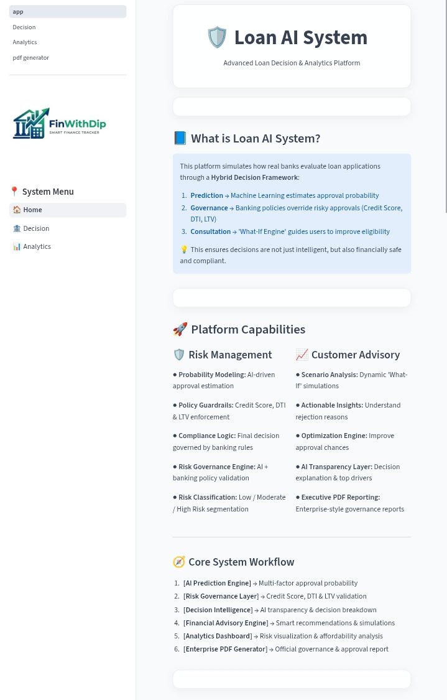
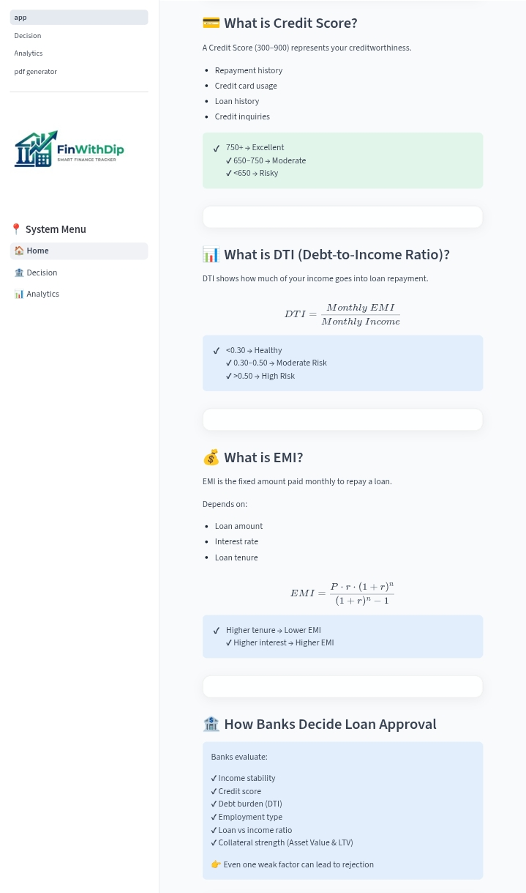
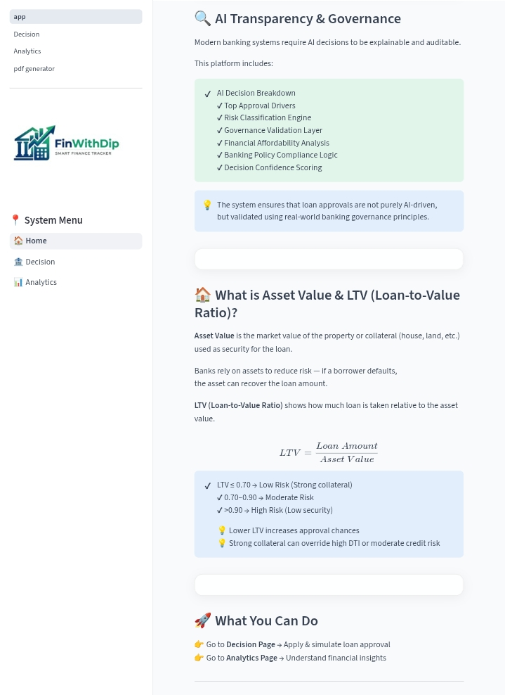
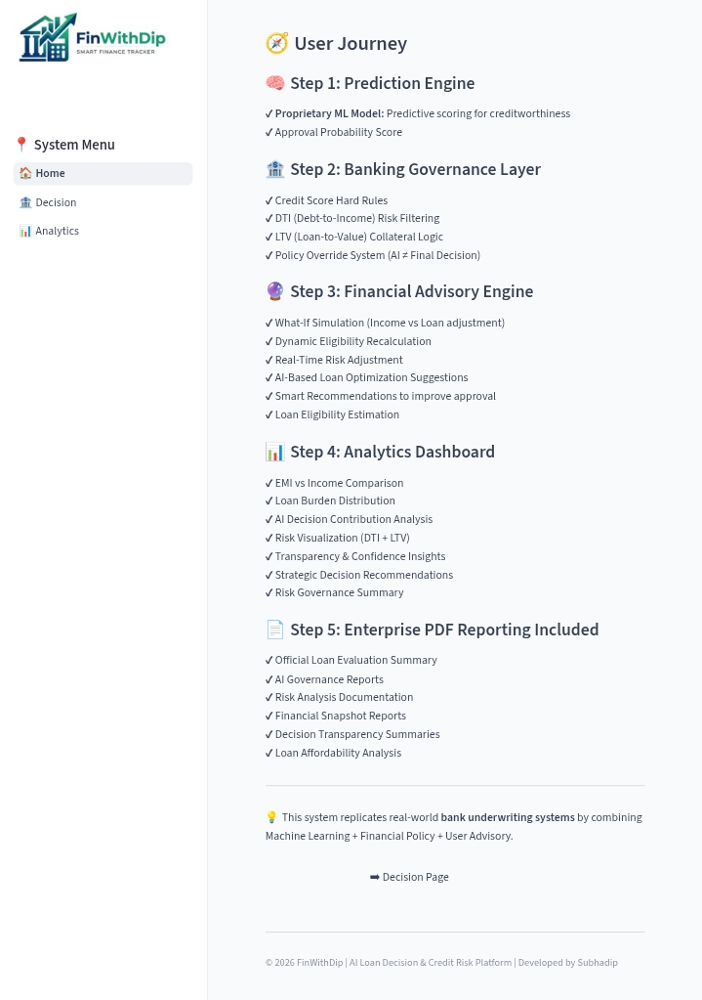
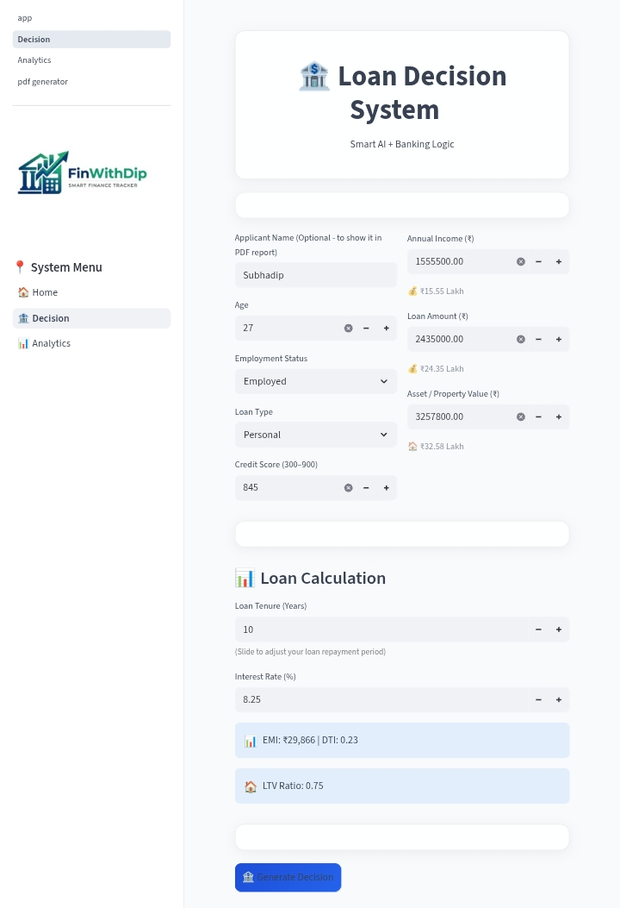
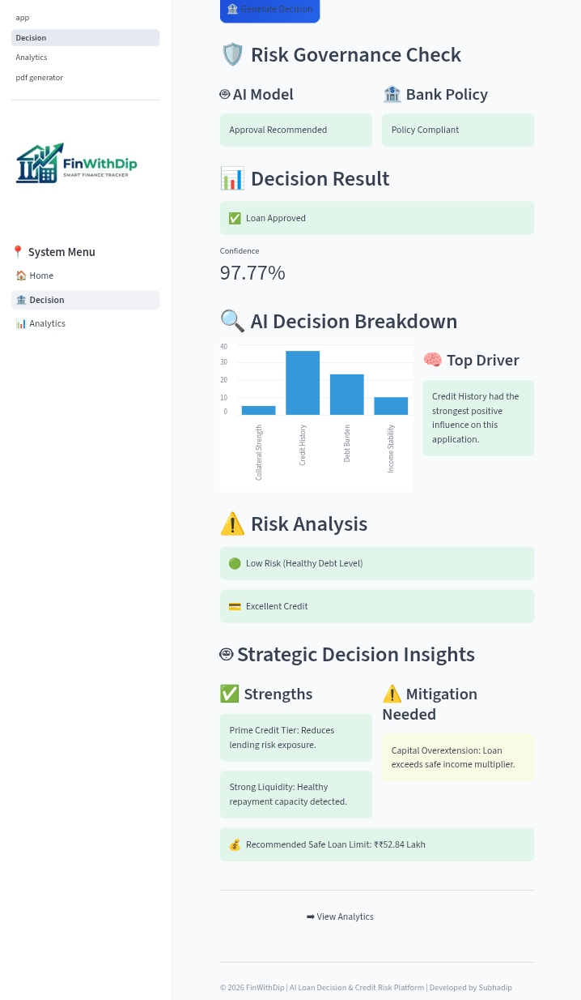
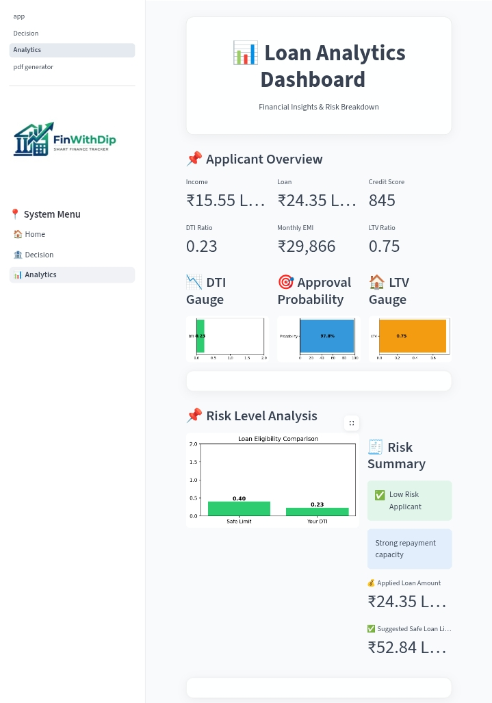
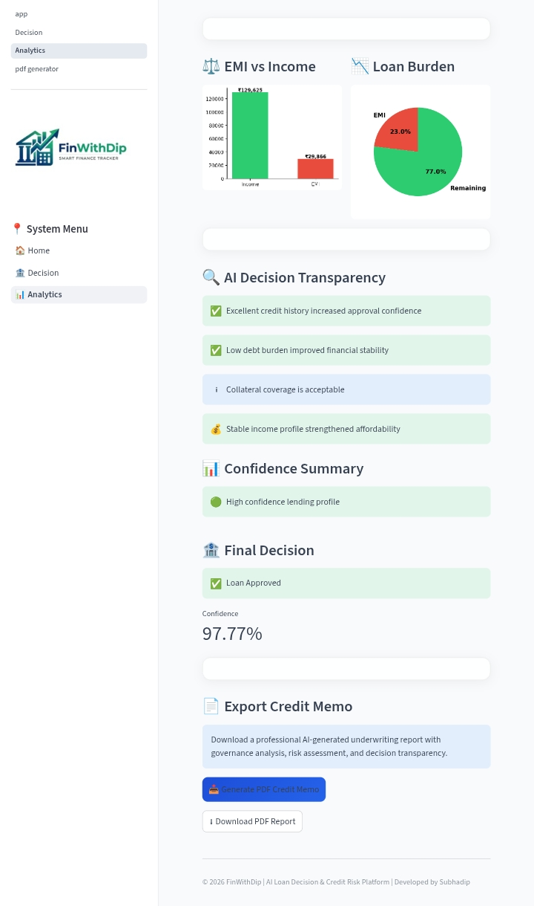
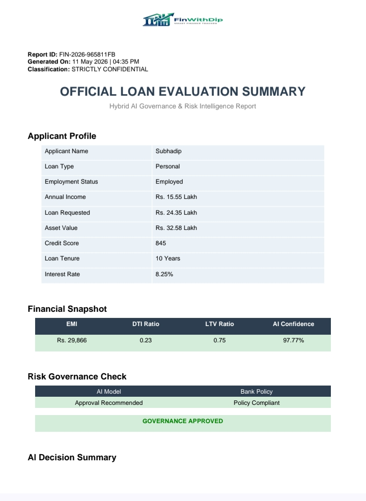
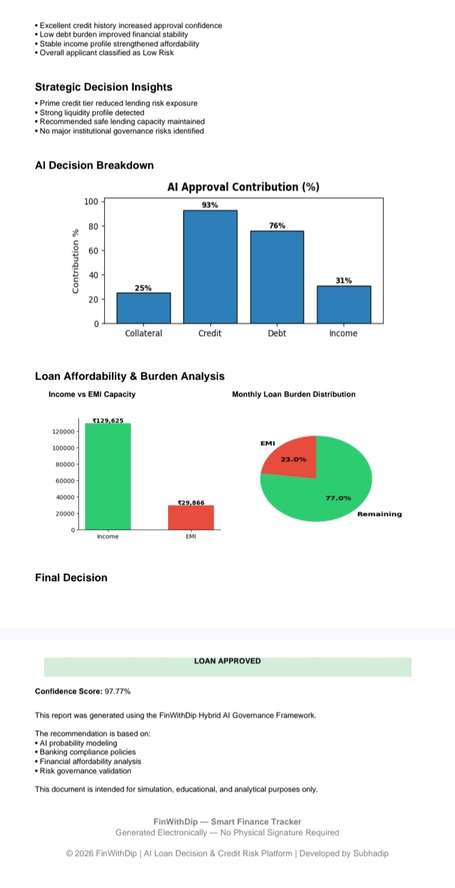

# AI Loan Decision & Credit Risk Platform 🏦🤖

AI-driven banking decision platform combining Machine Learning, Financial Governance, Risk Analytics, Explainable AI, and Enterprise Reporting workflows.

Enterprise AI-powered Loan Underwriting & Credit Risk Intelligence Platform developed using Machine Learning, Banking Governance Logic, Financial Analytics, and AI-driven advisory systems.

👨‍💻 Developed By: **Subhadip Kumar**

🌐 Live Application:  
https://ai-loan-decision-dip.streamlit.app/

💻 GitHub Repository:  
https://github.com/IamDip-SK10/Loan-Project

---

# 🚀 Platform Overview

This platform simulates how real-world banks and financial institutions evaluate loan applications using a hybrid framework of:

- AI Prediction Models
- Banking Governance Rules
- Credit Risk Intelligence
- Financial Advisory Systems
- Analytics & Reporting Engines

The system combines:

✔ Machine Learning  
✔ Financial Policy Validation  
✔ Credit Risk Assessment  
✔ Explainable AI  
✔ AI Transparency  
✔ Enterprise PDF Reporting  

---

# 🧠 Core Features

## 🏦 AI Loan Decision Engine

- ML-based approval prediction
- Approval probability scoring
- AI decision confidence analysis
- Multi-factor creditworthiness evaluation
- Risk-aware underwriting simulation

---

## 🛡️ Banking Governance Layer

- Credit Score validation
- DTI (Debt-to-Income) risk filtering
- LTV (Loan-to-Value) collateral analysis
- Policy override engine
- Banking compliance logic
- Governance approval validation

---

## 💡 Financial Advisory Engine

- EMI Calculator
- Loan eligibility estimation
- What-If simulation engine
- Safe loan recommendation
- Real-time affordability analysis
- AI-powered financial suggestions

---

## 📊 Analytics Dashboard

- EMI vs Income visualization
- Loan burden distribution
- Risk segmentation
- AI transparency insights
- Decision breakdown analysis
- Confidence analytics

---

## 📄 Enterprise PDF Reporting

- AI-generated underwriting report
- Governance summary
- Credit memo generation
- Risk analytics documentation
- Financial snapshot reports
- Decision transparency reporting

---

# 🖼️ Project Screenshots

---

# 🏠 Home Page

## Platform Introduction









---

# 🏦 Loan Decision System

## Applicant Evaluation Interface



---

## AI Decision & Governance Analysis



---

# 📊 Loan Analytics Dashboard

## Applicant Financial Overview



---

## Risk Analytics & AI Transparency



---

# 📄 Enterprise PDF Credit Memo

## Official Loan Evaluation Report





---

# 🧾 Key Financial Concepts Implemented

## 💳 Credit Score Analysis

- Creditworthiness evaluation
- Risk categorization
- Banking score thresholds
- Approval confidence enhancement

---

## 📉 DTI (Debt-to-Income Ratio)

- Income burden analysis
- Monthly EMI affordability
- Financial stress detection
- Repayment risk analysis

---

## 🏠 LTV (Loan-to-Value Ratio)

- Collateral strength analysis
- Asset-backed risk evaluation
- Loan security governance
- Safe lending ratio validation

---

## 💰 EMI Intelligence

- Loan repayment calculations
- Interest impact analysis
- Tenure optimization
- Monthly affordability estimation

---

# 🔍 AI Transparency & Governance

The platform includes:

- AI decision breakdown
- Top approval drivers
- Governance validation layer
- Financial affordability analysis
- Banking policy compliance checks
- Decision confidence scoring
- Risk classification engine
- Explainable AI insights

This ensures decisions are:

✔ Explainable  
✔ Auditable  
✔ Financially Safe  
✔ Policy-Compliant  
✔ Governance Validated  

---

# ⚙️ Core Workflow

## Step 1 — AI Prediction Engine

- Predictive scoring
- Approval probability estimation
- Creditworthiness modeling

---

## Step 2 — Banking Governance Layer

- Credit policy validation
- DTI & LTV risk checks
- Governance override logic

---

## Step 3 — Financial Advisory Engine

- What-if simulations
- Loan optimization recommendations
- Risk-adjusted suggestions

---

## Step 4 — Analytics Dashboard

- Risk visualization
- Confidence analytics
- Financial insights
- Transparency reporting

---

## Step 5 — Enterprise PDF Reporting

- Official underwriting summaries
- Governance documentation
- AI transparency reports
- Executive credit memo generation

---

# 📈 Business & Banking Impact

- Simulates enterprise-style underwriting workflows
- Demonstrates AI + governance integration in banking
- Improves financial decision transparency
- Provides explainable AI insights for risk analysis
- Models real-world lending risk evaluation systems
- Simulates banking-grade approval governance

---

# 🛠️ Tech Stack

- Python
- Streamlit
- Machine Learning
- Scikit-Learn
- Pandas
- NumPy
- Matplotlib
- Plotly
- ReportLab

---

# 📂 Project Structure

```bash
Loan-Project/
│
├── app.py
├── requirements.txt
├── pages/
│   ├── 1_Decision.py
│   ├── 2_Analytics.py
│   └── pdf_generator.py
│
├── decision_chart.png
├── emi_vs_income.png
├── loan_burden.png
├── financelogo.png
│
├── description1.jpg
├── description2.jpg
├── description3.jpg
├── description4.jpg
│
├── decision1.jpg
├── decision2.jpg
│
├── analytics1.jpg
├── analytics2.jpg
│
├── pdf1.jpg
└── pdf2.jpg
```

---

# 🔮 Future Enhancements

- Real-time API integration
- Advanced ML model deployment
- Fraud detection engine
- Credit bureau integration
- Customer segmentation analytics
- Cloud-native deployment architecture
- AI governance monitoring layer
- Multi-bank policy simulation

---

# 🎯 Project Objective

This project demonstrates how modern financial institutions combine:

- Artificial Intelligence
- Banking Governance
- Credit Risk Intelligence
- Financial Analytics
- Advisory Systems
- Enterprise Reporting

to create intelligent, explainable, and policy-compliant loan underwriting systems.

The platform is designed to simulate enterprise-grade banking workflows while showcasing AI transparency, governance validation, risk analytics, and financial advisory capabilities in a modern FinTech environment.

---

# 👨‍💻 Developer

## Subhadip Kumar

AI • FinTech • Banking Analytics • Financial Intelligence

🌐 Portfolio:  
https://iamdip-sk10.github.io/subhadip-portfolio/

🌐 Live Project:  
https://ai-loan-decision-dip.streamlit.app/

💻 GitHub Repository:  
https://github.com/IamDip-SK10/Loan-Project

---
